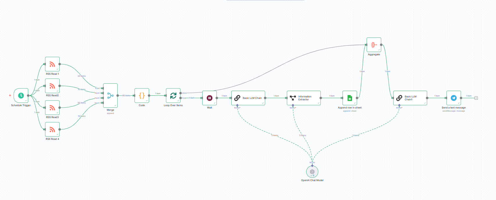
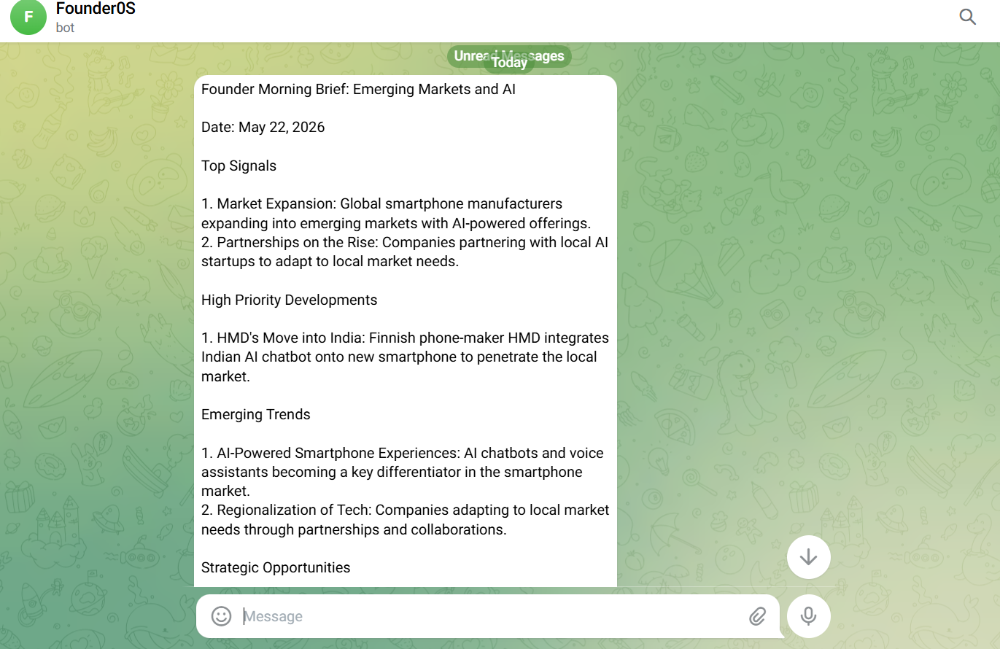

# FounderOS - AI-Powered Founder Intelligence Operating System

FounderOS is an AI-powered strategic intelligence platform built using n8n, Groq LLMs, Google Sheets, and Telegram.

The system automates the process of collecting startup and technology news, analyzing articles using AI models, extracting structured business intelligence, storing insights in a persistent database, and generating executive-level strategic briefings.

The primary objective of this project is to simulate how founders, strategy teams, and product teams can automate market intelligence gathering and convert large volumes of information into concise and actionable insights.

---

## Features

- Automated startup and technology news aggregation using RSS feeds
- AI-based strategic analysis of articles
- Structured business intelligence extraction
- Persistent intelligence storage using Google Sheets
- Executive founder brief generation
- Telegram-based automated report delivery
- Multi-stage AI workflow orchestration using n8n
- Automated trend monitoring pipeline

---

## Tech Stack

| Technology | Purpose |
|---|---|
| n8n | Workflow orchestration and automation |
| Groq LLM API | AI analysis and strategic insight generation |
| Google Sheets API | Persistent intelligence database |
| Telegram Bot API | Automated delivery system |
| RSS Feeds | News ingestion |
| Information Extractor Node | Structured data extraction |

---

## Workflow Architecture

```text
RSS Sources
     ↓
News Aggregation
     ↓
AI Strategic Analysis
     ↓
Structured Intelligence Extraction
     ↓
Google Sheets Memory Layer
     ↓
Executive Brief Generation
     ↓
Telegram Delivery
```

---

## Workflow Overview

The workflow starts by collecting startup and technology-related news articles from multiple RSS feeds.

Each article is processed through an AI analysis pipeline where the model generates:
- article summaries
- business impact analysis
- strategic insights
- priority classification
- category tagging

The generated intelligence is then converted into structured output using extraction nodes and stored inside Google Sheets, which acts as a persistent intelligence database.

After all insights are collected, the workflow aggregates the intelligence and generates a consolidated Founder Morning Brief containing:
- important market signals
- emerging trends
- strategic opportunities
- potential risks

The final report is automatically delivered through Telegram.

---

## Screenshots

### n8n Workflow



### Telegram Executive Brief



### Intelligence Database


---

## Demo Video

[Watch Project Demo](demo/founderos_demo.mp4)

---

## Key Learnings

Through this project, I explored:
- AI orchestration workflows
- Workflow automation using n8n
- Prompt engineering
- Structured data extraction
- Multi-stage AI pipelines
- Business intelligence systems
- Real-time notification systems
- Automation architecture design

---

## Future Improvements

- Competitor intelligence monitoring
- Priority-based instant alerts
- Weekly AI trend reports
- Notion dashboard integration
- Sentiment analysis layer
- Web-based analytics dashboard
- AI-powered opportunity scoring


w AI-powered automation systems can help founders, product teams, and strategy teams efficiently consume market information and convert raw news into structured strategic intelligence.
